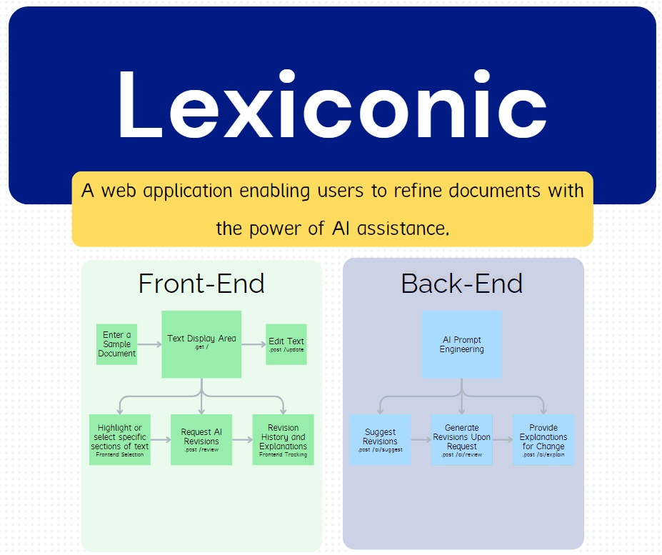
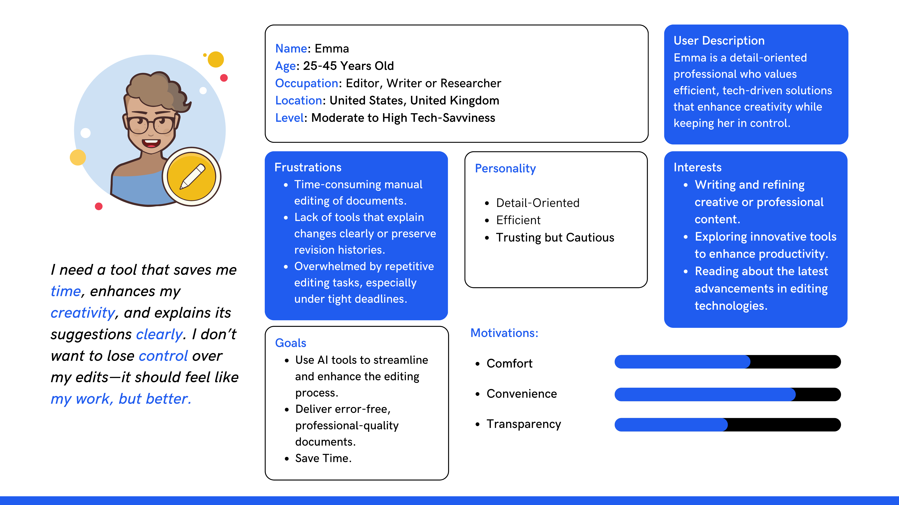
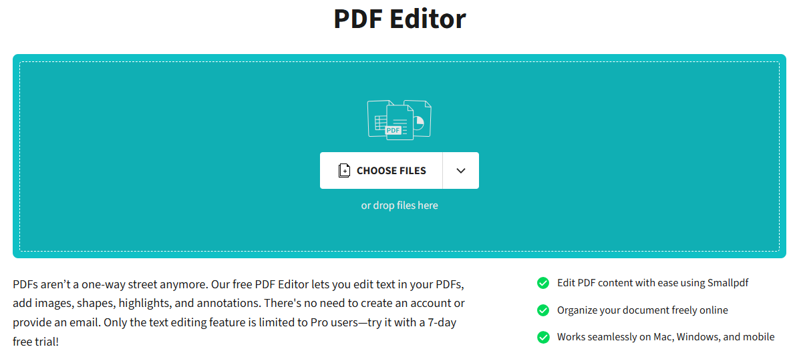
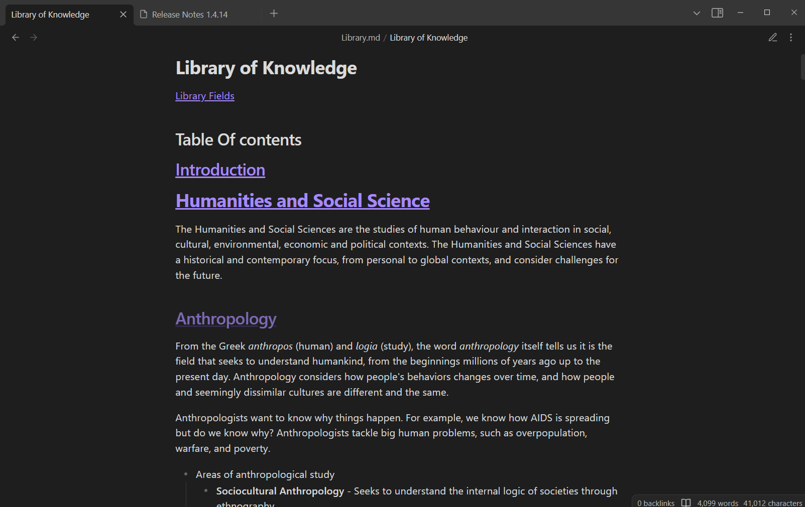
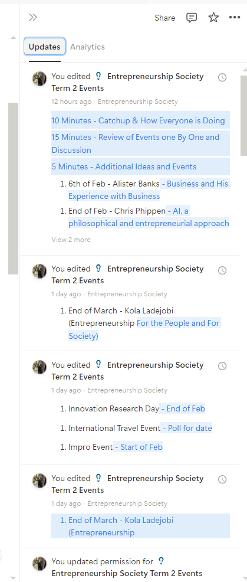
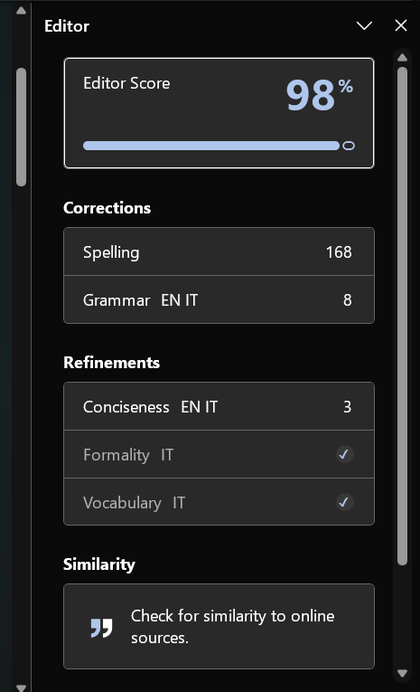
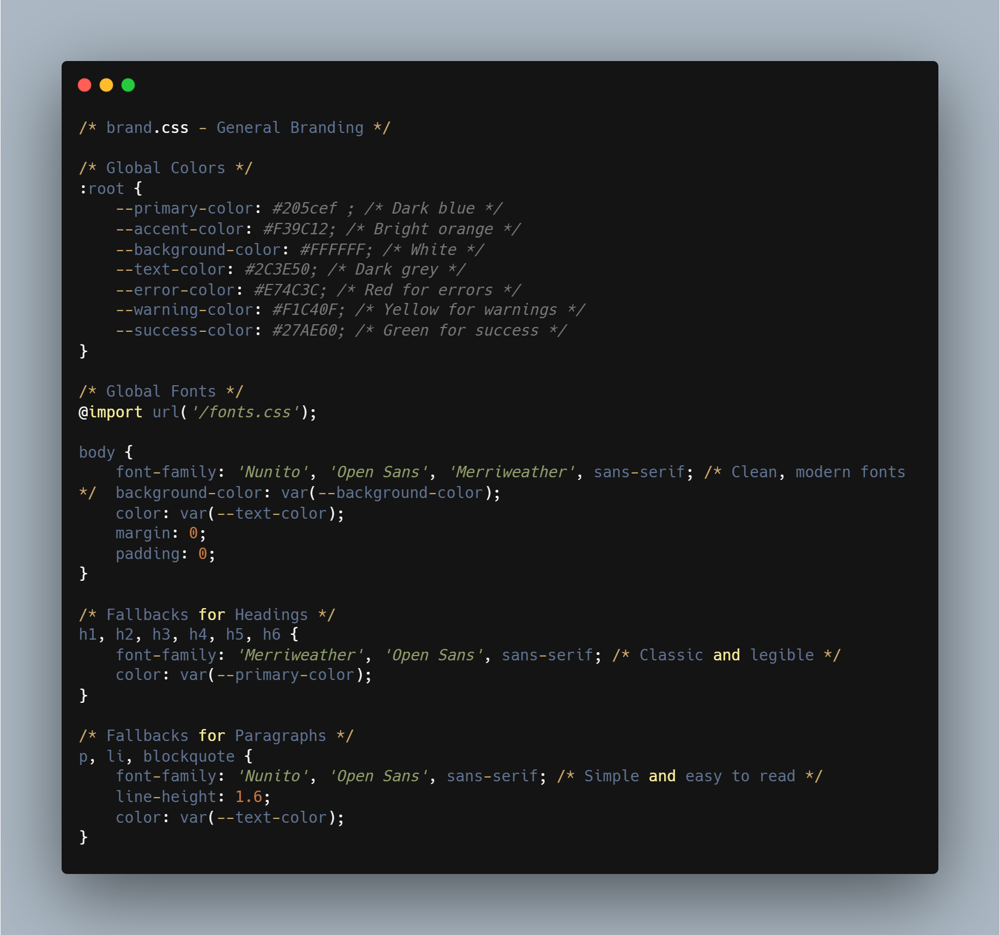
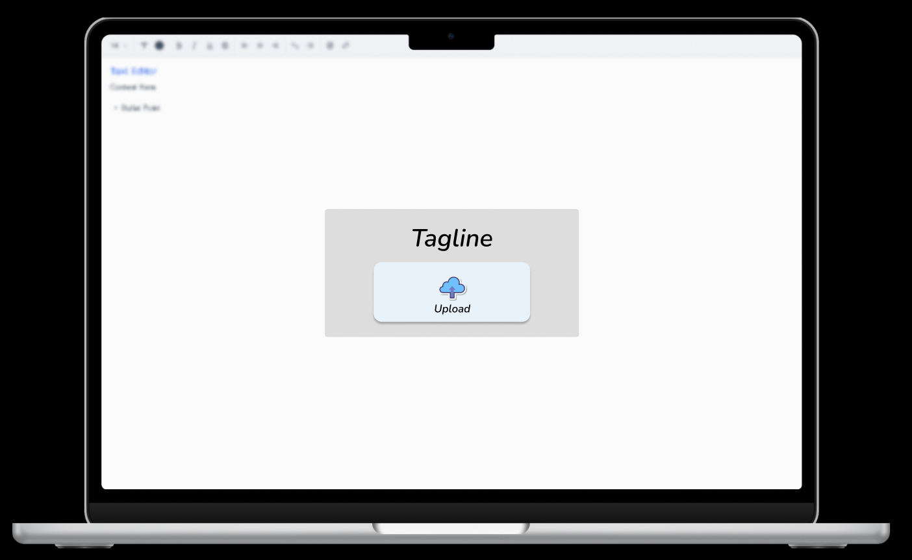
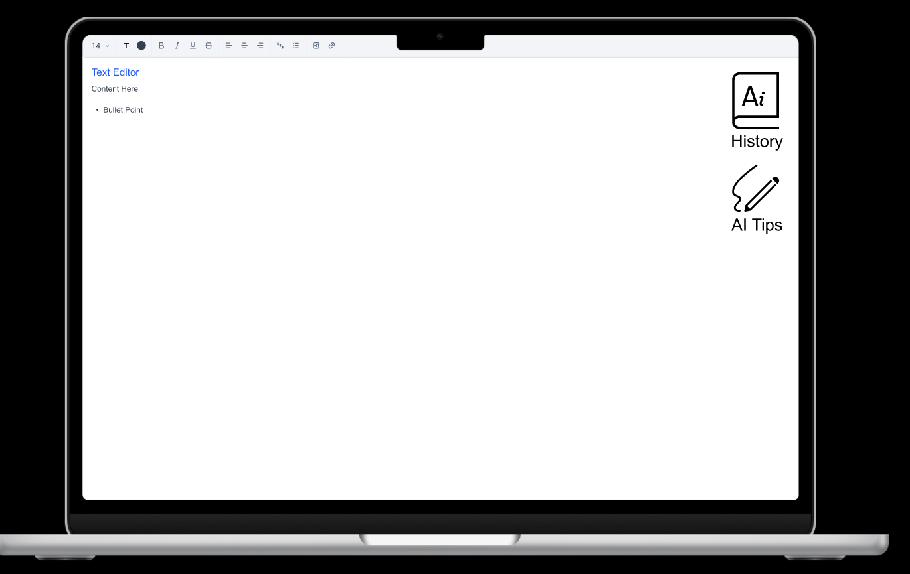
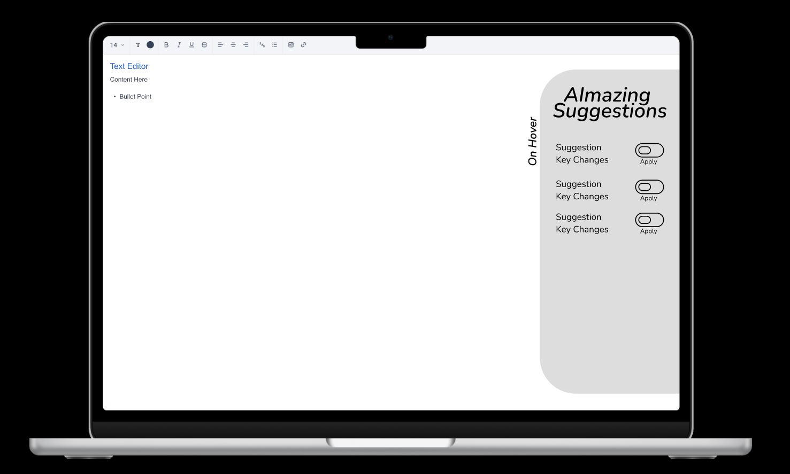

# Changelog & Roadmap

This document servers both as tracking my progress on the task and as future professional changelog. All notable changes to this project will be documented in this file.

The format is based on [Keep a Changelog](https://keepachangelog.com/en/1.0.0/).

---

## [0.1.0] - Precoding Analysis

*Time: 1h*

### Tasks In Chronological Order

- Naming the Project **Lexiconic** based on descriptor and brand value (futuristic stealth-mode startup yet appealing to writers).
- Creation of the Template Repository Based on Previous Work. Creation of the README, DOCUMENTATION and CHANGELOG Files.
- Creation of the Git Repository.
- Task Analysis. Highlighting Key areas.
- Used Canva ([Link Here](https://www.canva.com/design/DAGcQc0MUYw/iPz-ixYficcwMsLrqOD7-Q/edit?utm_content=DAGcQc0MUYw&utm_campaign=designshare&utm_medium=link2&utm_source=sharebutton)) to create a custom project structure

- Customer Persona Analysis on Canva. In order to build a tool, we need to understand who will use the tool, how it will be used and why it will be used. I focused specifically on the need of the customer persona that will help up defined the wording on the application.

- Moodboard: I studied existing competitors (AI and non-AI). I looked specifically at the following aspects: How they organise the writing section. How they organise version history. How they integrate AI capabilities.

SmallPDF: Upload PDF

Obsidian: Text Editor

Notion: Version History

Word: AI Suggestions

- Brand Creation Based on the Customer Persona (Naming, Logo, Colors, Fonts). Find in: *css/brand.css*

This CSS defines a clean, modern branding style with **blue (#205cef)** as the primary for professionalism (yet creativity as it is not a heavily dark blue), and **orange (#F39C12)** for accents like links or call-to-actions. Fonts use **Nunito** (modern), **Merriweather** (classic), and **Open Sans** as fallback for readability. Buttons follow the colour scheme with smooth hover transitions. Headings stand out with a classic touch, while paragraphs ensure legibility with clear line spacing. This setup balances creativity, professionalism, and accessibility.
Defining brand.css as an external files allows consistent branding and guidelines over growing applications.

- Created the Custom Logo to Reflect the Branding. Conveying the idea of Dictionary, Artificial Intelligence and i of iconic.

- Imported Fonts (From Google Fonts)
- Created a Roadmap of future developments and tasks.

---

## [0.1.1] - Precoding Front-End Design

*Time: 1h*

- Figma Prototype Design
  With my note taking application Einote, I had the opportunity to interview 100+ with my premium for feedback model. Over my multiple iterations and the hundred of thousand of codes written, there are some key learnings. First of all, the interface should be as clean as possible. Writers want to focus on their text. Whenever possible, navbar and expandable should be preferred over constant buttons that could constitute a nuisance. Additionally, it should be text and editor first first. With the text editor centered and taking the core of the focus. It is also important to provide an interface that is clean and calming, allowing for hours and hours on the screen.
  Note: This are initial prototypes that would usually be reviewed with the Client. It differs from the final website.

Note: The Figma Simulation is available [here](https://www.figma.com/proto/RgLTsedXEm5qH500Qnsa6d/Lexiconic?page-id=0%3A1&node-id=6-294&viewport=165%2C-371%2C0.48&t=VMAlYBxEInaseii5-1&scaling=scale-down&content-scaling=fixed&starting-point-node-id=6%3A294)

---

## [1.0.1] - Coding the Front-End

*Time: 8h*

- I started with the EJS (HTML) structure, putting down all the divs, headers and paragraphs in the home.ejs page
- I gave a general feel to the platform via CSS
- Added Quill
- Added AI Suggestion Feature
- Added Notyf
- Added Version Control Feature
- Added Dictionary Suggestion Feature
  Inspiration from Solidworks and Github. Giving Feadback on specific word and lines. While there exist libraries to do it, in house development was choosen for professionalism.

---

## [1.0.2] - Coding the Back-End

*Time: 5h*

- Added the AI Suggestions Features
- Implemented the File Upload Features
- Implemeneted the Dictionary Suggestion Feature
- Added Various Middlewares

---

## [1.0.3] - Unit Testing

*Time: 2h*

- Create the Unit Testing Page [here](/TESTING.md). More information on the page.

---

## [1.0.4] - Uploading and Hosting

*Time: 0.5h*

- Got my (hundredth) domain at [lexiconic.tech](lexiconic.tech)
- Changed the DNS Register to point to Digital Ocean
- Created a New Digital Ocean App
- Connect Digital Ocean to Github with Auto Deploy
- Connected the Domain to Digital Ocean
- Added sitemap.xml, robot.txt, license.txt
- Enjoy!

---

# Future Developments (Roadmap)

- [ ] **Initial Bug Fixes and General Improvements**
  - [ ] **Update History Feature**
    - [ ] **Bug:** Make Version Reverting Keeps Formatting  
      - **Fix**: Store previous versions using Quill Deltas rather than plain text.
    - [ ] **Bug:** Nested Descendant Versions Not Reverting  
      - **Fix**: Limit the number of nested elements and review the nested code logic.
  - [ ] **Insert Suggestions Feature**
    - [ ] **Bug**: Multiple Suggestions inserted in a row do not remove all letters  
      - **Fix**: Update architecture to consider the modified word instead of the original.
    - [ ] **Bug**: Inserting a Suggestion sometimes removes adjacent punctuation  
      - **Fix**: Ensure punctuation is preserved during insertion.
    - [ ] **Bug**: Nested Suggestions are not generated (e.g., a synonym of a synonym)  
      - **Quick Fix**: Block nested suggestions entirely.  
      - **Long Fix**: Redesign architecture to support nested suggestions properly.

- [ ] **First Range of Features**
  - [ ] **File Upload**
    - [ ] Maintain formatting on file upload  
      - **Options**: Manually improve conversions or use better third-party tools.
    - [ ] Allow users to start with empty files.
    - [ ] Provide templates as sample content.
  - [ ] **Update History**
    - [ ] Add a manual save feature.
    - [ ] Differentiate between temporal and change-based versions.
  - [ ] **Tutorial**
    - [ ] Implement the tutorial.
    - [ ] Move the tutorial to an external page to improve main page performance.
  - [ ] **AI Review**
    - [ ] Use the "Compare text" helper function to compare AI-enabled text.
  - [ ] Show key file information (e.g., word count, read time).
  - [ ] Allow customisation of download file types.

- [ ] **Database**
  - [ ] **File Storage**
    - [ ] Connect to a database (e.g., AWS DynamoDB).
    - [ ] Assign unique IDs to documents.
    - [ ] Provide a dashboard for managing documents.
  - [ ] **Authentication System**
    - [ ] Use AWS Cognito or a similar solution.
    - [ ] **Email**
      - [ ] Enable email verification.
    - [ ] **Password**
      - [ ] Add password reset functionality.
    - [ ] **Encryption**
      - [ ] Use SSL certificates.
      - [ ] Encrypt data at rest and in transit.
      - [ ] Implement restricted system-level keys.

- [ ] **Add a Dashboard to Control Files**
  - [ ] **File Management**
    - [ ] File creation.
    - [ ] File deletion.
    - [ ] File updates.
  - [ ] **File Sharing System**
    - [ ] Asynchronous collaboration.
    - [ ] Synchronous (real-time) collaboration.
  - [ ] Add sorting and searching functionality.
  - [ ] Implement folders, tags, and pins for better organisation.

- [ ] **Analytics**
  - [ ] Set up Google Analytics.
  - [ ] Write and include a privacy and cookie policy.
  - [ ] Collect button click data.
  - [ ] Configure Google Search Console and related analytics tools.

- [ ] **Payments**
  - [ ] Use Stripe to implement a paywall.
    - [ ] Set up a Stripe account.
    - [ ] Configure the Stripe dashboard.
    - [ ] Add paywalls and rate limits.
    - [ ] Use webhooks for user upgrades.

- [ ] **Referral System**
  - [ ] Provide discounts or free files to referrals.

- [ ] **Affiliate System**
  - [ ] Offer a percentage commission for affiliates.

- [ ] **Tutorial**
  - [ ] Add interactive tutorial actions (e.g., users work on their own content during the tutorial).
  - [ ] Include tutorial videos.
  - [ ] Add a reward system (e.g., discounts or free files for completing tutorials).

- [ ] **SEO**
  - [ ] Perform a proper SEO analysis.
  - [ ] Connect to Google Search Console and related tools.
  - [ ] Optimise SEO (meta descriptions, titles, social sharing tags).

- [ ] **Blogging**
  - [ ] Create a blog template.
  - [ ] Add an admin interface for creating

- [ ] **Optional Features**
  - [ ] Improve accessibility:
    - [ ] Add text-to-speech functionality.
    - [ ] Enable dictation for writing.
    - [ ] Support large text options.
  - [ ] Add themes, including a dark mode.
  - [ ] Create a Chrome extension.
  - [ ] Develop a mobile app.
  - [ ] Enable multiple tabs for files.
  - [ ] Add a graph view for content.
  - [ ] Implement an AI chatbot.
  - [ ] Add workspace import/export functionality.