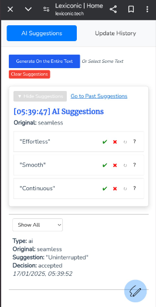

# **DEMO.md**

Here are three ways to explore a demo of Lexiconic:

## 1. **Visit the Domain (Preferred)**
Access the live version of Lexiconic at [lexiconic.tech](https://lexiconic.tech). This is the easiest and fastest way to experience the app in action.

---

## 2. **Clone and Run the Repo Locally**

Follow the instructions in the `/README` file to set up the project on your local machine. This includes:
- Cloning the repository
- Installing dependencies
- Running the development server

For detailed steps, refer to the "Getting Started" section in the [README.md](./README.md).

---

## 3. **Images Below**
Here are some screenshots showcasing the app:

- And Obviously Mobile

