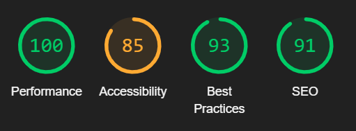

# **TESTING.md**

## **Overview**

This document provides an overview of the testing strategy, tools, and results for the project. It outlines the approach used to ensure code quality, stability, and reliability.

---

## **1. Lighthouse Report**

- **Framework**: Lighthouse 
- **Setup**:
  - Available in major browsers in the browser development tool.
- **(Desktop) Results**:

    - First Contentful Paint is: 0.3 s
    - Speed Index is: 0.7 s
    - Need to Improve my JS minification and caching
    - Improve Contrast Ratio
  - (I Unfortunately had to Remove the Full HTML Report as it was making GitHub Crash)

---

## **2. SEMrush Report**

- **Framework**: SEMrush 
- **Setup**:
  - Available at SEMrush
- **Results**:
  - Out of the Scope of the project but to consider in the future.

---

## **3. File Upload Testing**

- **Framework**: Manual Testing 
- **Setup**:
  - File Over the Weight Limit
  - File Just Under the Weight Limit
  - Extremely Long Text File
  - No File
  - Empty File
  - All Allowed File Types
  - Not Allowed File Type
  - File with API Key
  - File with "SQL Type" Injection
- **Results**:
  - TEST TO RUN (in the future) - some initial files tested

---

## **4. Prompt Injection & Jailbreaking**

- **Framework**: Manual Testing 
- **Setup**:
  - Prompts with API Secrets
  - Insulting Prompts
  - Dangerous Prompts
  - Unethical Prompts
  - Prompt with "SQL Type" Injection
  - Manipulative Prompts
- **Results**:
  - TEST TO RUN (in the future) - some initial prompts tested

---

## **5. DDOS Testing**

- **Framework**: Python File 
- **Setup**:
  - Simulate thousands of requests from one or several IPs
  - Hopefully not crash
- **Results**:
    - Not Run as Explained [here](/test/ddos_test.py).

--- 

## **6. Mobile Testing**

- **Framework**: Browser 
- **Setup**:
  - Open Developer Tools
  - Test for Multiple Mobile Devices 
- **Results**:
  - Fully Working on Mobile
  - Either open the Website ([lexiconic.tech](lexiconic.tech)) or see the images in [DEMO.md](/DEMO.md)

---

## **7. Low Wifi Testing**

- **Framework**: Browser 
- **Setup**:
  - Open Developer Tools
  - Test for multipe Device Connection Speed
- **Results**:
  - Notyf Helps with the wait
  - Could consider using (interactive) % filling animation to show (or fake) progress
